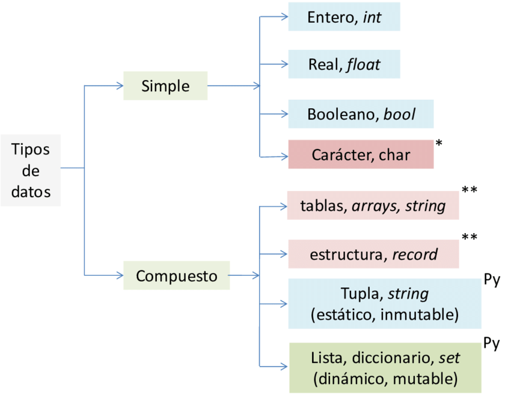

<div align="center">
  <h1>Básico de Python</h1>
</div>

<div align="center">
  
</div>

# Tabla de contenido
- [Introducción a la programación con Python](#Introducción-a-la-programación-con-Python)
    - [¿Por qué Python?](#¿Por-qué-Python?)
    - [El núcleo de un programa: los algoritmos](#El-núcleo-de-un-programa-los-algoritmos)
    - [Instalación de nuestras herramientas](#Instalación-de-nuestras-herramientas)
    - [Instalación de nuestras herramientas en Mac](#Instalación-de-nuestras-herramientas-en-Mac)
    - [Instalación de nuestras herramientas en Ubuntu](#Instalación-de-nuestras-herramientas-en-Ubuntu)
    - [Tu mejor herramienta: la consola](#Tu-mejor-herramienta-la-consola)
- [Conceptos básicos de Python](#Conceptos-básicos-de-Python)
    - [Explorando Python](#Explorando-Python)
    - [¿Qué es una variable?](#¿Qué-es-una-variable?)
    - [Los primitivos: tipos de datos sencillos](#Los-primitivos-tipos-de-datos-sencillos)
    - [Convertir un dato a un tipo diferente](#Convertir-un-dato-a-un-tipo-diferente)
    - [Tu primer programa: conversor de monedas](#Tu-primer-programa-conversor-de-monedas)
- [Herramientas para programar](#Herramientas-para-programar)
    - [Condicionales](#Condicionales)


# <a name="Introducción-a-la-programación-con-Python">Introducción a la programación con Python</a>

## <a name="¿Por-qué-Python?">¿Por qué Python?</a>

#### Python funciona muy bien en estos 4 campos

#### Internet de las cosas

-El internet de las cosas ​ es un concepto que se refiere a una interconexión digital de objetos cotidianos con internet.​​ Es, en definitiva, la conexión de internet más con objetos que con personas.​ También se suele conocer como internet de todas las cosas o internet en las cosas.

#### Inteligencia artificial


-La inteligencia artificial (IA) es la inteligencia llevada a cabo por máquinas. En ciencias de la computación, una máquina «inteligente» ideal es un agente flexible que percibe su entorno y lleva a cabo acciones que maximicen sus posibilidades de éxito en algún objetivo o tarea.1​ Coloquialmente, el término inteligencia artificial se aplica cuando una máquina imita las funciones «cognitivas» que los humanos asocian con otras mentes humanas, como por ejemplo: «percibir», «razonar», «aprender» y «resolver problemas».

#### backend

-El back end del sitio web consiste en un servidor, una aplicación y una base de datos. Se toman los datos, se procesa la información y se envía al usuario. Los desarrolladores de Front end y Back end suelen trabajar juntos para que todo funcione correctamente.

#### Ciencia de datos

-La ciencia de datos es un campo interdisciplinario que involucra métodos científicos, procesos y sistemas para extraer conocimiento o un mejor entendimiento de datos en sus diferentes formas, ya sea estructurados o no estructurados,1​ lo cual es una continuación de algunos campos de análisis de datos como la estadística, la minería de datos, el aprendizaje automático, y la analítica predictiva.1​

#### Ventajas
- Fácil de aprender
- Elegante
- Buenas prácticas

## <a name="El-núcleo-de-un-programa-los-algoritmos">El núcleo de un programa: los algoritmos</a>

#### ¿Qué es un Algoritmo?

En términos de programación, un algoritmo es una secuencia de pasos lógicos que permiten solucionar un problema.

#### Partes de un algoritmo
Todo algoritmo debe constar de las siguientes partes:

- Input o entrada. El ingreso de los datos que el algoritmo necesita para operar.
- Proceso. Se trata de la operación lógica formal que el algoritmo emprenderá con lo recibido del input.
- Output o salida. Los resultados obtenidos del proceso sobre el input, una vez terminada la ejecución del algoritmo.

#### ¿Para qué sirve un algoritmo?
Dicho muy llanamente, un algoritmo sirve para resolver paso a paso un problema. Se trata de una serie de instrucciones ordenadas y secuenciadas para guiar un proceso determinado.

En las Ciencias de la computación, no obstante, los algoritmos constituyen el esqueleto de los procesos que luego se codificarán y programarán para que sean realizados por el computador.

#### Características de los algoritmos

Los algoritmos presentan las siguientes características:

- Secuenciales. Los algoritmos operan en secuencia, debe procesarse uno a la vez.
- Precisos. Los algoritmos han de ser precisos en su abordaje del tema, es decir, no pueden ser ambiguos o subjetivos.
- Ordenados. Los algoritmos se deben establecer en la secuencia precisa y exacta para que su lectura tenga sentido y se resuelva el problema.
- Finitos. Toda secuencia de algoritmos ha de tener un fin determinado, no puede prolongarse hasta el infinito.
- Concretos. Todo algoritmo debe ofrecer un resultado en base a las funciones que cumple.
- Definidos. Un mismo algoritmo ante los mismos elementos de entrada (input) debe dar siempre los mismos resultados.

#### Ejemplos de algoritmos

Algoritmo para calcular el área de un triángulo rectángulo:

- INICIO
- Hallar las medidas de la base (b) y altura (h)
- Multiplicar: base por altura (b x h)
- Dividir entre 2 el resultado (b x h) / 2
- FIN

#### Diagrama de flujo

El diagrama de flujo o flujograma o diagrama de actividades es la representación gráfica de un algoritmo o proceso. Se utiliza en disciplinas como programación, economía, procesos industriales y psicología cognitiva.


<div align="center">
  
</div>


## <a name="Instalación-de-nuestras-herramientas">Instalación de nuestras herramientas</a>

```sh
https://www.python.org/
```
<div align="center">
  
</div>


```sh
https://cmder.net/
```
> Cmder es un programa portable para todas las versiones de Windows que se ofrece en dos variantes: Una
> versión mínima que funciona como la terminal de Windows que ya conocemos, y una completa que, además,
> incluye compatibilidad con comandos Unix


```sh
https://code.visualstudio.com/
```
<div align="center">
  
</div>

<div align="center">
  
</div>
<div align="center">
  
</div>


## <a name="Instalación-de-nuestras-herramientas-en-Mac">Instalación de nuestras herramientas en Mac</a>

- La consola / terminal / línea de comandos
- El editor de código: Visual Studio Code
- El lenguaje de programación: Python

#### Instalación de la consola
En Mac no necesitas instalar una consola a diferencia de Windows. Sin embargo, para poder usar correctamente la terminal debes seguir una serie de pasos:

Abre la carpeta Aplicaciones. Luego, ve a Utilidades y haz doble click en la aplicación Terminal. Esto debería abrirte la consola de comandos. Si no te funcionó o no encontraste la aplicación de Terminal, puedes pulsar ⌘ + barra espaciadora para abrir Spotlight. Allí escribe “Terminal” y haz click en el primer resultado de búsqueda.

<div align="center">
  
</div>

#### Ejecuta los siguientes comandos:

```sh
sudo xcode-select --install
sudo xcode-select --reset
```
La Terminal te pedirá que ingreses la contraseña de administrador de tu computadora. Házlo.

<div align="center">
  
</div>

<div align="center">
  
</div>


#### Instalación del editor de código

- Abre tu navegador preferido (Safari, Chrome, el que quieras) y dirígete a

```sh
https://code.visualstudio.com/
```

<div align="center">
  
</div>

- Una vez allí, haz click en el botón “Download for Mac” o “Descargar para Mac”


<div align="center">
  
</div>

- Abre la lista de archivos descargados de tu navegador, y encuentra el instalador
<div align="center">
  
</div>

- Arrastra el archivo Visual Studio Code.app a la carpeta Aplicaciones
<div align="center">
  
</div>

- Añade el editor al dock dándole click derecho al ícono que te aparece en pantalla y seleccionando “Options” u “Opciones”, y luego “Keep in dock” o “Mantener en el dock”

<div align="center">
  
</div>


#### Instalación de Python
El lenguaje de programación es la joya de la corona de nuestras herramientas. Sin Python no puedes programar, es así de simple. Sigue los siguientes pasos:

Abre tu navegador preferido (Safari, Chrome, el que quieras) y dirígete a

```sh
https://www.python.org/downloads/
```
<div align="center">
  
</div>

- Da click en el botón “Download Python 3.x.x”. En las “x” vas a ver números. Lo importante es que el primer número sea un 3, los dos que siguen no nos interesan, porque cambian todo el tiempo.

- Abre el instalador descargado, y sigue los pasos
<div align="center">
  
</div>

<div align="center">
  
</div>

## <a name="Instalación-de-nuestras-herramientas-en-Ubuntu">Instalación de nuestras herramientas en Ubuntu</a>


- La consola / terminal / línea de comandos
- El editor de código: Visual Studio Code
- El lenguaje de programación: Python

#### Instalación de la consola
En Ubuntu no necesitas instalar una consola a diferencia de Windows. Para poder usar la terminal debes presionar Ctrl + Alt + t y voilà, se abrirá frente a tus ojos

#### Instalación del editor de código
Abre tu navegador preferido (Firefox, Chrome, el que quieras) y dirígete a

```sh
https://go.microsoft.com/fwlink/?LinkID=760868
```
<div align="center">
  
</div>

Abre el archivo descargado. Notarás que termina en “.deb”
<div align="center">
  
</div>

Sigue los pasos de instalación

<div align="center">
  
</div>

Introduce la contraseña de tu sistema:
<div align="center">
  
</div>
Espera a que termine la instalación:
<div align="center">
  
</div>
Instalación finalizada:

#### Instalación de Python
Abre tu terminal y ejecuta los siguientes comandos:

```sh
sudo apt update
```
```sh
sudo apt install python3-pip
```
Te mostrará si deseas continuar con la instalación, da click en enter.

La instalación empezará:

Ejecuta el comando para verificar que el lenguaje de programación se instaló correctamente

```sh
python3 -V
```

## <a name="Tu-mejor-herramienta-la-consola">Tu mejor herramienta: la consola</a>

## Comandos básicos para usar la consola:

| Comando | Descripción |
| ------ | ------ |
| py | Iniciar la consola interactiva de python en Microsoft Windows |
| python3 | Iniciar la consola interactiva de python en Debian o derivados |
| Ctrl + L | Ctrl + L = Limpiar pantalla |
| python3 nombreEscript.py | Ejecutar un script de Python |


# <a name="Conceptos-básicos-de-Python">Conceptos básicos de Python</a>

## <a name="Explorando-Python">Explorando-Python</a>

## Operadores aritméticos

En cuanto a los operadores aritméticos, estos permiten realizar las diferentes operaciones aritméticas del álgebra.

> PEMDAS, que en castellano podríamos traducir como PAPOMUDAS (PAréntesis, POtencias, MUltiplicación, División, Adición, Sustracción).

| Operador | Descripción | Ejemplo |
| ------ | ------ | ------ |
| + | Adición (Suma) | 3 + 2 = 5 |
| - | Sustracción (Resta) | 4 - 7 = -3 |
| - | Negación | -7 = -7|
| * | Multiplicación | 2 * 6 = 12 |
| ** | Exponente | 2 ** 6 = 64 |
| / | División (con decimales) | 3.5 / 2 = 1.75 |
| //	 | División entera (Sin decimales) | 3.5 // 2 = 1.0 |
| % | Módulo (Resto de la división) | 7 % 2 = 1 |


Raiz cuadrada en Python

Primera forma:
```sh
9**0.5
```

Segunda forma:

```sh
import math

math.sqrt(9)
```

## Operadores de asignación

El operador de asignación se utiliza para asignar un valor a una variable. Como te he mencionado en otras secciones, este operador es el signo =.

Además del operador de asignación, existen otros operadores de asignación compuestos que realizan una operación básica sobre la variable a la que se le asigna el valor.

Por ejemplo, x += 1 es lo mismo que x = x + 1. Los operadores compuestos realizan la operación que hay antes del signo igual, tomando como operandos la propia variable y el valor a la derecha del signo igual.

A continuación, aparece la lista de todos los operadores de asignación compuestos:

| Operador | Descripción | Ejemplo |
| ------ | ------ | ------ |
| = | Asigna valor a una variable | r = 5;|
| += | Suma el valor a la variable | r = 5; r += 10; r = 15 |
| -= | Resta el valor a la variable | r = 5; r -= 10; r = -5 |
| *= | Multiplica el valor a la variable | r = 5; r *= 10; r = 50 |
| /= | Divide el valor a la variable | r = 5; r /= 10; r = 0 |
| **= | Calcula el exponente del valor de la variable | r = 5; r **= 10; r = 9765625 |
| //= | Calcula la división entera del valor de la variable | r = 5; r //= 10; r = 0 |
| %= | Devuelve el resto de la división del valor de la variable | r = 5; r %= 10; r = 5 |


## Operadores de comparación

Los operadores de comparación se utilizan, como su nombre indica, para comparar dos o más valores. El resultado de estos operadores siempre es True o False.


| Operador | Descripción | Ejemplo |
| ------ | ------ | ------ |
| == | ¿son iguales a y b? | 5 == 3 False|
| != | ¿son distintos a y b? | 5 != 3 True |
| < | ¿es a menor que b? | 5 < 3 False |
| > | ¿es a mayor que b? | 5 > 3 True |
| <= | ¿es a menor o igual que b? | 5 <= 5 True |
| >= | ¿es a mayor o igual que b? | 5 >= 3 True |


## Operadores lógicos o booleanos

A la hora de operar con valores booleanos, tenemos a nuestra disposición los operadores and, or y not.

> ❗️ IMPORTANTE: Las operaciones and, or y not realmente no devuelven True o False, sino que devuelven uno de los operandos como veremos en el cuadro de abajo.

| Operador | Resultado | Descripción |
| ------ | ------ | ------ |
| a or b | Si a se evalúa a falso, entonces devuelve b, si no devuelve a | Solo se evalúa el segundo operando si el primero es falso |
| a and b | Si a se evalúa a falso, entonces devuelve a, si no devuelve b | Solo se evalúa el segundo operando si el primero es verdadero |
| not a | Si a se evalúa a falso, entonces devuelve True, si no devuelve False | Tiene menos prioridad que otros operadores no booleanos |

### Ejemplos
```sh
estudia = True
trabaja = False
estudia and trabaja
# False
```

```sh
estudia = True
trabaja = False
estudia or trabaja
# True
```


```sh
estudia = True
not estudia
# False
```

## <a name="¿Qué-es-una-variable?">¿Qué es una variable?</a>

Es un lugar en memoria (una especie de caja) en el que podemos guardar objetos (números, texto, etc). Esta variable posee un identificador o nombre con el cual podemos llamarla cuando la necesitemos.

No pueden empezar con un número. Deben estar en minúsculas Para separar las palabras usamos el guion bajo: _ Estas reglas son aplicadas al lenguaje python, en otros lenguajes pueden haber otras reglas.

Asignación de su edentificador o nombre a una variable

```sh
nombreDeLaVariable
```

(=) O operador de asignación se utiliza para asignar un valor a una variable. Como te he mencionado en otras secciones, este operador es el signo =

```sh
nombreDeLaVariable = 15
```
Reasignación de variables

```sh
edad = 15
edad = 46
print(edad)
# 46
```

Suma con variables

```sh
a = 5
b = 5
total = a + b
print(total)
# 10
```

## <a name="Los-primitivos-tipos-de-datos-sencillos">Los primitivos: tipos de datos sencillos</a>

En python todo es un objeto

<div align="center">
  
</div>


## Tipos de datos simples


| Dato | Significado |
| ------ | ------ |
| int(8) | entero |
| real(4.8) | float |
| bool(True,False) | booleano |
| char("hola") | string |


Entero
```sh
edad = 45
print(edad)
# 45
```

Float
```sh
PrecioPan = 1.50
print(PrecioPan)
# 1.50
```

Booleano
```sh
activo = False
print(activo)
# False
```

string

```sh
nombre = "Luis"
print(nombre)
# "Luis"
```

Concatenacion (Unir dos textos)

```sh
nombre = "Luis "
apellido = "Morales"

concatenacion = nombre + apellido
print(concatenacion)
# "Luis Morales"
```

Multiplicar el contenido de una variable string
```sh
saludo = "Hola"
saludo * 2
# "Hola Hola"
```


## <a name="Convertir-un-dato-a-un-tipo-diferente">Convertir un dato a un tipo diferente</a>

Pasar de un tipo de dato a otro


| Sintaxis | Descripción |
| ------ | ------ |
| int(var) | variable a entero |
| float(var) | variable a flotante |
| str(var) | variable a texto |
| bool(var) | variable a booleano |
| abs(var) | variable a valor absoluto |


Algunas funciones propias de Python

```sh
# la funcion input("") para pedirle al usuario que introduzca datos
input("Escribe tu edad")

# La función type() devuelve el tipo del objeto
type(variable)
```

Ejemplo: 1

```sh
num = input("Escribe un número: ")
# Escribe un número: 4
num1 = input("Escribe otro número: ")
# Escribe un número: 4
num + num1
# '44'


Solución al ejemplo

num = int(input("Escribe un numero: "))
# Escribe un numero: 4
num1 = int(input("Escribe otro numero: "))
# Escribe otro numero: 4
num + num1
# 8
```


Ejemplo 2:

```sh
numero1 = 4.5
int(numero1)
# 4 <== Lo convierte a un numero entero
```
Ejemplo 3:

```sh
numero1 = 4.5
str(numero1)
# '4.5' <== Lo convierte a texto
```

## <a name="Tu-primer-programa-conversor-de-monedas">Tu primer programa: conversor de monedas</a>

## Algunas notas importantes

> Para darle soporte a acentos en nuestros programas debemos usar lo siguiente

```sh
# -*- coding: utf-8 -*-
```

> Sintaxis correcta de ejecutar un programa en python. Donde definimos donde queremos que empiece nuestro programa Porque si no lo hacemos se ejecutara de arriba hacia avajo y no es la forma correcta de ejecutarlo. El nombre de la funcion principal por estandar de la comunidad puede ser main o run


```sh
def run():
  print("Hola mundo");

if __name__ == '__main__':
  run()
```

> Para poder imprimir el valor de una variable dentro de un string podemos hacerlo así:

```sh
'Me llamo {0}'.format(variable)
```

## Programa

```sh
# Pedimos al usuario un valor lo convertimos de string a float y lo guardamos en la variable quetzales
quetzales = float(input("¿Cuantos Quetzales tienes?: "));

valorDolar = 7

dolares = quetzales / valorDolar
# Quitamos los desimales y indicamos la cantidad de desimales que yo quiero
# round(variable, cantidadDeDesimalesQueYoQuiero)
dolares = round(dolares, 2)


# Dos formas para mostrarlo al usuario

# 1
# Lo debemos convertimos de float a string
# dolares = str(dolares)
# print("Tienes $ " + dolares + " dolares");

# 2
print('Tienes $ {0} dolares'.format(dolares));
```

> Codigo tambien del programa en la carpeta con nombre de 13


# <a name="Herramientas-para-programar">Herramientas para programar</a>

## <a name="Condicionales">Condicionales</a>

## if ... elif ... else ...

En esta lección se trata la estructura de control if ... elif ... else ...: Estas construcciones permiten condicionar la ejecución de uno o varios bloques de sentencias al cumplimiento de una o varias condiciones.

### Sentencias condicionales: if ...
La estructura de control if ... permite que un programa ejecute unas instrucciones cuando se cumplan una condición. En inglés "if" significa "si" (condición).

```sh
# Sintaxis de la sentencia condicional if ...

if condición:

  # bloque

```
La ejecución de esta construcción es la siguiente:

- La condición se evalúa siempre.
- Si el resultado es True se ejecuta el bloque de sentencias
- Si el resultado es False no se ejecuta el bloque de sentencias.

Ejemplo:

```sh
edad = 55

if edad < 18:
  print("Eres menor de edad")

```

### Bifurcaciones: if ... else ...

La estructura de control if ... else ... permite que un programa ejecute unas instrucciones cuando se cumple una condición y otras instrucciones cuando no se cumple esa condición. En inglés "if" significa "si" (condición) y "else" significa "si no". La orden en Python se escribe así:


```sh
# Sintaxis de la sentencia condicional if ... else ...

if condición:
  # bloque 1
else:
  # bloque 2
```
La ejecución de esta construcción es la siguiente:

- Si el resultado es True se ejecuta solamente el bloque 1 de sentencias
- Si el resultado es False se ejecuta solamente el bloque 2 de sentencias

Ejemplo:

```sh
edad = 55

if edad < 18:
  print("Eres menor de edad")
else:
  print("Eres mayor de edad")

# Eres mayor de edad
```

### Alternativas: if ... elif ... else ...

La construcción if ... else ... se puede extender añadiendo la instrucción elif:
La estructura de control if ... elif ... else ... permite encadenar varias condiciones. elif es una contracción de else if. La orden en Python se escribe así:

```sh
# Sintaxis de la sentencia condicional if ... elif ... else ...
if condición_1:
  # bloque 1
elif condición_2:
  # bloque 2
else:
  # bloque 3
```
La ejecución de esta construcción es la siguiente:

- Si se cumple la condición 1, se ejecuta el bloque 1
- Si no se cumple la condición 1 pero sí que se cumple la condición 2, se ejecuta el bloque 2
- Si no se cumplen ni la condición 1 ni la condición 2, se ejecuta el bloque 3.


Ejemplo:

```sh
edad = 55

if edad < 18:
  print("Eres menor de edad")
elif edad >= 18:
  print("Eres mayor de edad")
else:
  print("Jajajajaj talvez no eres humano")

# Eres mayor de edad
```


- [holaholaholahoa](#holaholaholaholah)

# <a name="holaholaholah">holaholaholaholaholah</a>

```sh
```
