<div align="center">
  <h1>Básico de Python</h1>
</div>

<div align="center"> 
  
</div>

# Tabla de contenido
- [Introducción a la programación con Python](#Introducción-a-la-programación-con-Python)
    - [¿Por qué Python?](#¿Por-qué-Python?)
    - [El núcleo de un programa: los algoritmos](#El-núcleo-de-un-programa-los-algoritmos)
    - [Instalación de nuestras herramientas](#Instalación-de-nuestras-herramientas)
    - [Instalación de nuestras herramientas en Mac](#Instalación-de-nuestras-herramientas-en-Mac)
    - [Instalación de nuestras herramientas en Ubuntu](#Instalación-de-nuestras-herramientas-en-Ubuntu)
    - [Tu mejor herramienta: la consola](#Tu-mejor-herramienta-la-consola)
- [Conceptos básicos de Python](#Conceptos-básicos-de-Python)
    - [Explorando Python: operadores aritméticos](#Explorando-Python-operadores-aritméticos)
    - [¿Qué es una variable?](#¿Qué-es-una-variable?)
    - [Los primitivos: tipos de datos sencillos](#Los-primitivos-tipos-de-datos-sencillos)
    - [Convertir un dato a un tipo diferente](#Convertir-un-dato-a-un-tipo-diferente)
    - [Operadores lógicos y de comparación](#Operadores-lógicos-y-de-comparación)
    - [Tu primer programa: conversor de monedas](#Tu-primer-programa-conversor-de-monedas)


# <a name="Introducción-a-la-programación-con-Python">Introducción a la programación con Python</a>

## <a name="¿Por-qué-Python?">¿Por qué Python?</a>

#### Python funciona muy bien en estos 4 campos 

#### Internet de las cosas

-El internet de las cosas ​ es un concepto que se refiere a una interconexión digital de objetos cotidianos con internet.​​ Es, en definitiva, la conexión de internet más con objetos que con personas.​ También se suele conocer como internet de todas las cosas o internet en las cosas.

#### Inteligencia artificial 


-La inteligencia artificial (IA) es la inteligencia llevada a cabo por máquinas. En ciencias de la computación, una máquina «inteligente» ideal es un agente flexible que percibe su entorno y lleva a cabo acciones que maximicen sus posibilidades de éxito en algún objetivo o tarea.1​ Coloquialmente, el término inteligencia artificial se aplica cuando una máquina imita las funciones «cognitivas» que los humanos asocian con otras mentes humanas, como por ejemplo: «percibir», «razonar», «aprender» y «resolver problemas».

#### backend

-El back end del sitio web consiste en un servidor, una aplicación y una base de datos. Se toman los datos, se procesa la información y se envía al usuario. Los desarrolladores de Front end y Back end suelen trabajar juntos para que todo funcione correctamente.

#### Ciencia de datos

-La ciencia de datos es un campo interdisciplinario que involucra métodos científicos, procesos y sistemas para extraer conocimiento o un mejor entendimiento de datos en sus diferentes formas, ya sea estructurados o no estructurados,1​ lo cual es una continuación de algunos campos de análisis de datos como la estadística, la minería de datos, el aprendizaje automático, y la analítica predictiva.1​

#### Ventajas 
- Fácil de aprender
- Elegante
- Buenas prácticas

## <a name="El-núcleo-de-un-programa-los-algoritmos">El núcleo de un programa: los algoritmos</a>

#### ¿Qué es un Algoritmo?

En términos de programación, un algoritmo es una secuencia de pasos lógicos que permiten solucionar un problema.

#### Partes de un algoritmo
Todo algoritmo debe constar de las siguientes partes:

- Input o entrada. El ingreso de los datos que el algoritmo necesita para operar.
- Proceso. Se trata de la operación lógica formal que el algoritmo emprenderá con lo recibido del input.
- Output o salida. Los resultados obtenidos del proceso sobre el input, una vez terminada la ejecución del algoritmo.

#### ¿Para qué sirve un algoritmo?
Dicho muy llanamente, un algoritmo sirve para resolver paso a paso un problema. Se trata de una serie de instrucciones ordenadas y secuenciadas para guiar un proceso determinado.

En las Ciencias de la computación, no obstante, los algoritmos constituyen el esqueleto de los procesos que luego se codificarán y programarán para que sean realizados por el computador.

#### Características de los algoritmos

Los algoritmos presentan las siguientes características:

- Secuenciales. Los algoritmos operan en secuencia, debe procesarse uno a la vez.
- Precisos. Los algoritmos han de ser precisos en su abordaje del tema, es decir, no pueden ser ambiguos o subjetivos.
- Ordenados. Los algoritmos se deben establecer en la secuencia precisa y exacta para que su lectura tenga sentido y se resuelva el problema.
- Finitos. Toda secuencia de algoritmos ha de tener un fin determinado, no puede prolongarse hasta el infinito.
- Concretos. Todo algoritmo debe ofrecer un resultado en base a las funciones que cumple.
- Definidos. Un mismo algoritmo ante los mismos elementos de entrada (input) debe dar siempre los mismos resultados.

#### Ejemplos de algoritmos

Algoritmo para calcular el área de un triángulo rectángulo:

- INICIO
- Hallar las medidas de la base (b) y altura (h)
- Multiplicar: base por altura (b x h)
- Dividir entre 2 el resultado (b x h) / 2
- FIN

#### Diagrama de flujo

El diagrama de flujo o flujograma o diagrama de actividades es la representación gráfica de un algoritmo o proceso. Se utiliza en disciplinas como programación, economía, procesos industriales y psicología cognitiva.


<div align="center"> 
  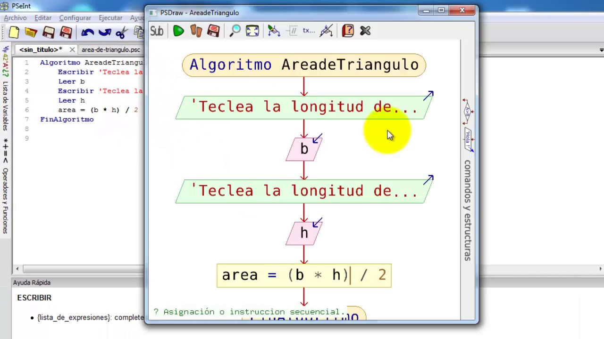
</div>


## <a name="Instalación-de-nuestras-herramientas">Instalación de nuestras herramientas</a>

```python
https://www.python.org/
```
<div align="center"> 
  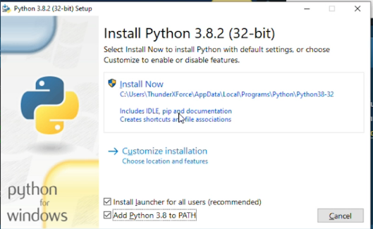
</div>


```python
https://cmder.net/
```
> Cmder es un programa portable para todas las versiones de Windows que se ofrece en dos variantes: Una 
> versión mínima que funciona como la terminal de Windows que ya conocemos, y una completa que, además, 
> incluye compatibilidad con comandos Unix


```python
https://code.visualstudio.com/
```
<div align="center"> 
  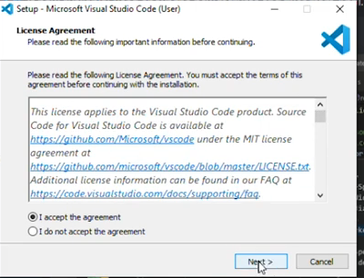
</div>

<div align="center"> 
  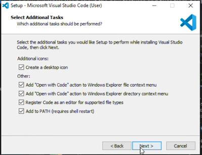
</div>
<div align="center"> 
  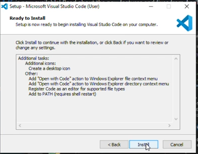
</div>


## <a name="Instalación-de-nuestras-herramientas-en-Mac">Instalación de nuestras herramientas en Mac</a>

- La consola / terminal / línea de comandos
- El editor de código: Visual Studio Code
- El lenguaje de programación: Python

#### Instalación de la consola
En Mac no necesitas instalar una consola a diferencia de Windows. Sin embargo, para poder usar correctamente la terminal debes seguir una serie de pasos:

Abre la carpeta Aplicaciones. Luego, ve a Utilidades y haz doble click en la aplicación Terminal. Esto debería abrirte la consola de comandos. Si no te funcionó o no encontraste la aplicación de Terminal, puedes pulsar ⌘ + barra espaciadora para abrir Spotlight. Allí escribe “Terminal” y haz click en el primer resultado de búsqueda.

<div align="center"> 
  
</div>

#### Ejecuta los siguientes comandos:

```python
sudo xcode-select --install
sudo xcode-select --reset
```
La Terminal te pedirá que ingreses la contraseña de administrador de tu computadora. Házlo.

<div align="center"> 
  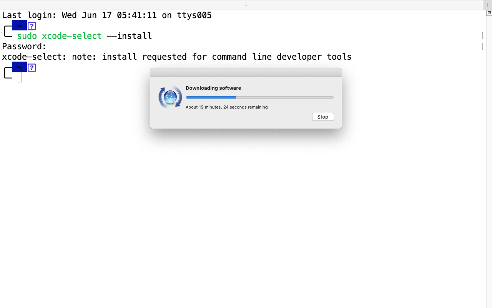
</div>

<div align="center"> 
  
</div>


#### Instalación del editor de código

- Abre tu navegador preferido (Safari, Chrome, el que quieras) y dirígete a

```python
https://code.visualstudio.com/
```
<div align="center"> 
  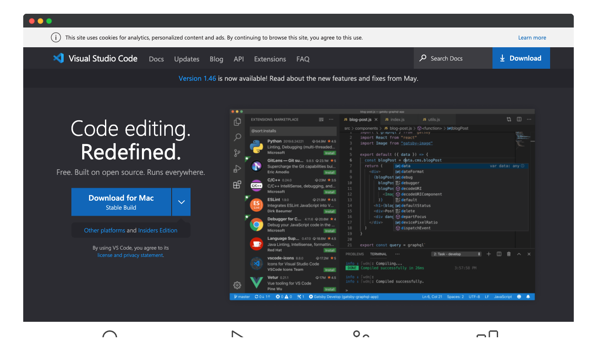
</div>

- Una vez allí, haz click en el botón “Download for Mac” o “Descargar para Mac”


<div align="center"> 
  
</div>

- Abre la lista de archivos descargados de tu navegador, y encuentra el instalador
<div align="center"> 
  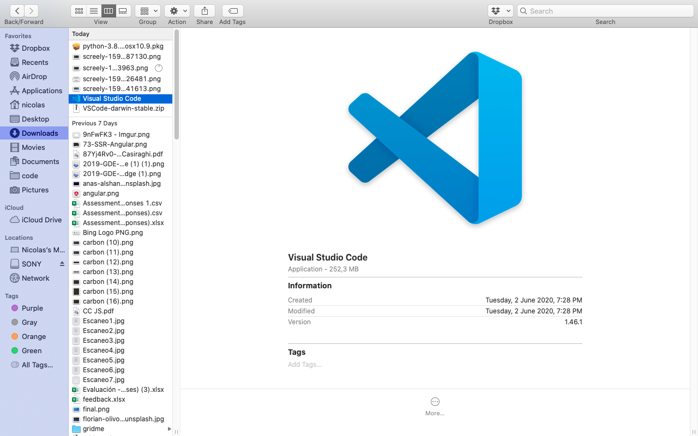
</div>

- Arrastra el archivo Visual Studio Code.app a la carpeta Aplicaciones
<div align="center"> 
  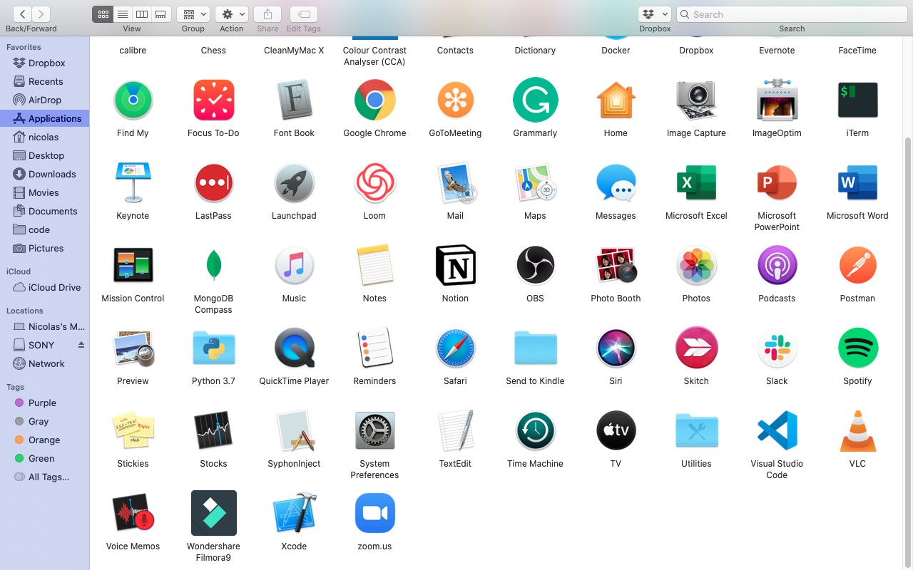
</div>

- Añade el editor al dock dándole click derecho al ícono que te aparece en pantalla y seleccionando “Options” u “Opciones”, y luego “Keep in dock” o “Mantener en el dock”

<div align="center"> 
  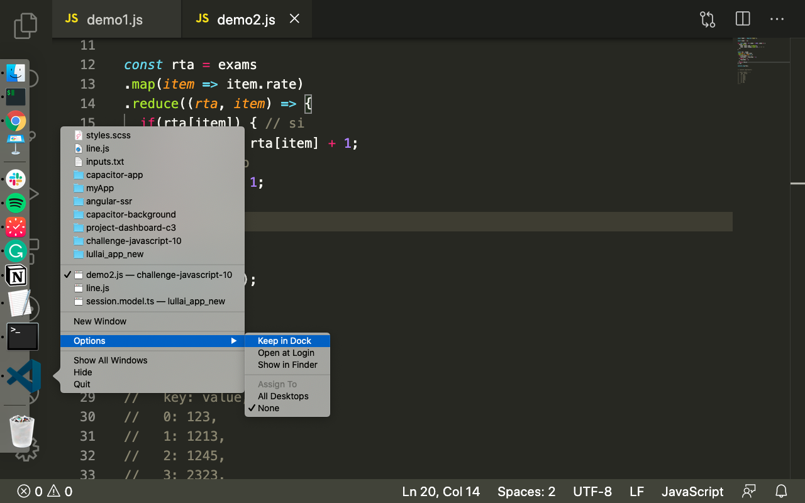
</div>


#### Instalación de Python
El lenguaje de programación es la joya de la corona de nuestras herramientas. Sin Python no puedes programar, es así de simple. Sigue los siguientes pasos:

Abre tu navegador preferido (Safari, Chrome, el que quieras) y dirígete a

```python
https://www.python.org/downloads/
```
<div align="center"> 
  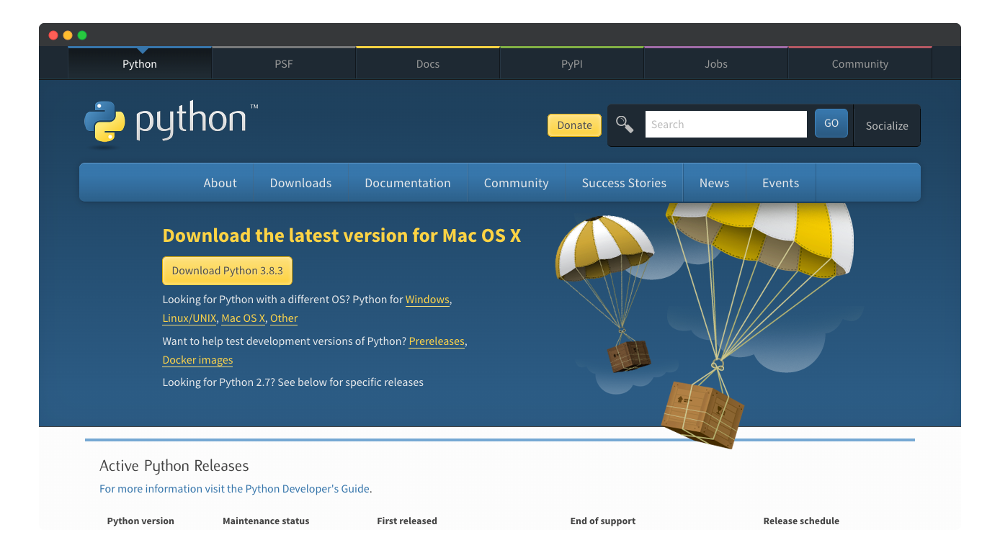
</div>

- Da click en el botón “Download Python 3.x.x”. En las “x” vas a ver números. Lo importante es que el primer número sea un 3, los dos que siguen no nos interesan, porque cambian todo el tiempo.

- Abre el instalador descargado, y sigue los pasos
<div align="center"> 
  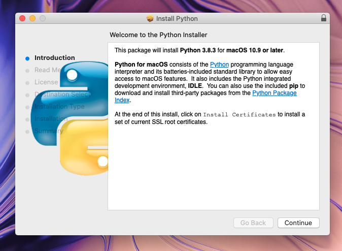
</div>

<div align="center"> 
  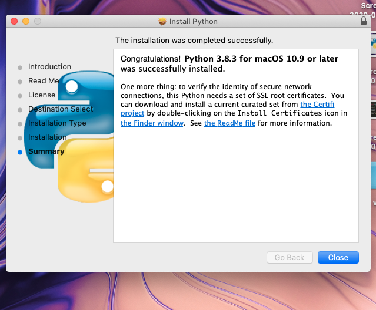
</div>

## <a name="Instalación-de-nuestras-herramientas-en-Ubuntu">Instalación de nuestras herramientas en Ubuntu</a>


- La consola / terminal / línea de comandos
- El editor de código: Visual Studio Code
- El lenguaje de programación: Python

#### Instalación de la consola
En Ubuntu no necesitas instalar una consola a diferencia de Windows. Para poder usar la terminal debes presionar Ctrl + Alt + t y voilà, se abrirá frente a tus ojos

#### Instalación del editor de código
Abre tu navegador preferido (Firefox, Chrome, el que quieras) y dirígete a 

```python
https://go.microsoft.com/fwlink/?LinkID=760868
```
<div align="center"> 
  
</div>

Abre el archivo descargado. Notarás que termina en “.deb”
<div align="center"> 
  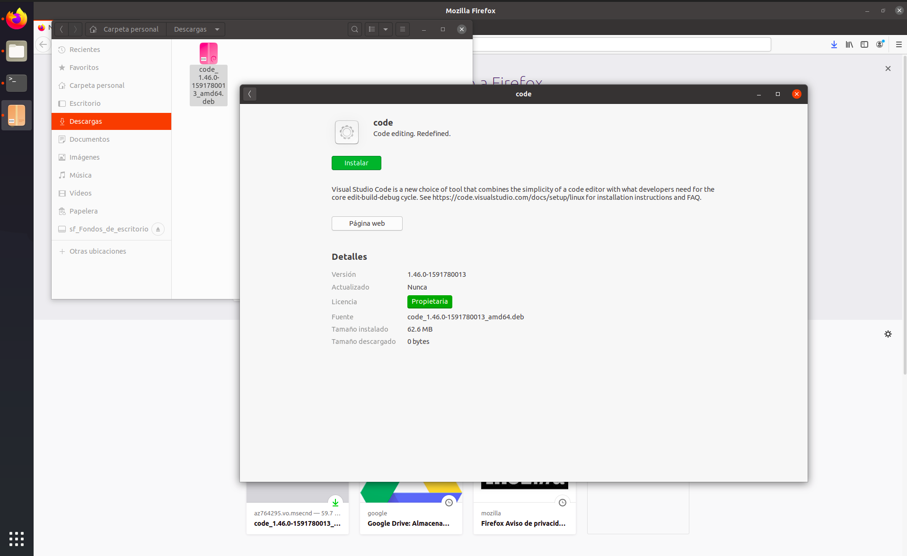
</div>

Sigue los pasos de instalación

<div align="center"> 
  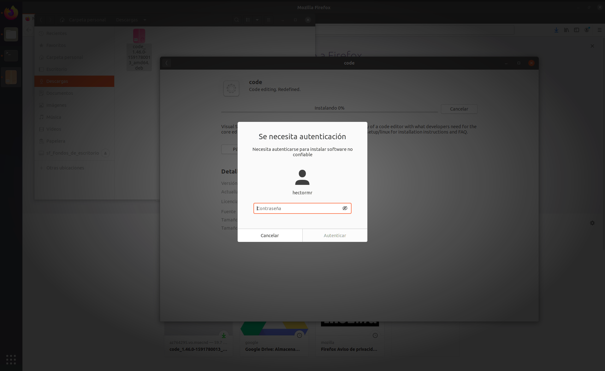
</div>

Introduce la contraseña de tu sistema:
<div align="center"> 
  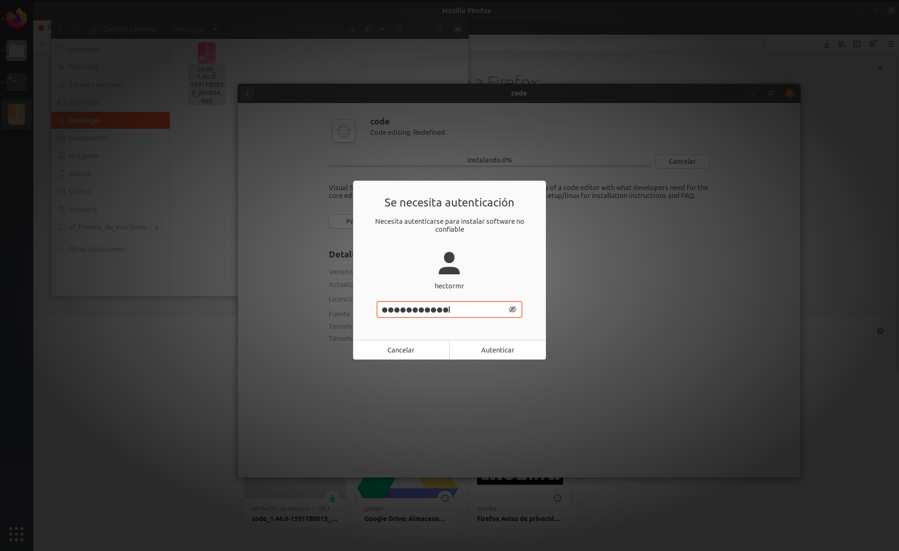
</div>
Espera a que termine la instalación:
<div align="center"> 
  
</div>
Instalación finalizada:

#### Instalación de Python
Abre tu terminal y ejecuta los siguientes comandos:

```python
sudo apt update
```
```python
sudo apt install python3-pip
```
Te mostrará si deseas continuar con la instalación, da click en enter.

La instalación empezará:

Ejecuta el comando para verificar que el lenguaje de programación se instaló correctamente

```python
python3 -V
```

Iniciar la consola interactiva de python en Microsoft Windows

```python
py
```
Iniciar la consola interactiva de python en Linux

```python
python3
```

## <a name="Tu-mejor-herramienta-la-consola">Tu mejor herramienta: la consola</a>

# <a name="Conceptos-básicos-de-Python">Conceptos básicos de Python</a>

## <a name="Explorando-Python-operadores-aritméticos">Explorando Python: operadores aritméticos</a>

> PEMDAS, que en castellano podríamos traducir como PAPOMUDAS (PAréntesis, POtencias, MUltiplicación, División, Adición, Sustracción).


| Operadores aritméticos | README |
| ------ | ------ |
| 5 + 5 | Adición (Suma) |
| 5 - 5 | Sustracción (Resta) |
| 5 * 5 | Multiplicación |
| 5 / 5 | División (con decimales) |
| 5 // 5 | División (sin decimales) |
| 21 % 5 | Resto de la división |
| 2 ** 2 | Potenciación |


Raiz cuadrada en Python de 9

Primera forma:
```python
9**0.5
```

Segunda forma:

```python
import math

math.sqrt(9)
```

## <a name="¿Qué-es-una-variable?">¿Qué es una variable?</a>

#### Creando Variables
Es un lugar en memoria (una especie de caja) en el que podemos guardar objetos (números, texto, etc). Esta variable posee un identificador o nombre con el cual podemos llamarla cuando la necesitemos.

No pueden empezar con un número. Deben estar en minúsculas Para separar las palabras usamos el guion bajo: _ Estas reglas son aplicadas al lenguaje python, en otros lenguajes pueden haber otras reglas.

- Asignación de variables con su edentificador o nombre
```python
nombreDeLaVariable
```
Asignándole un valor a la variable

```python
nombreDeLaVariable = 15
```
Reasignación de variables

```python
edad = 15
edad = 46
print(edad)
# 46
```
Suma con variables

```python
a = 5
b = 5
total = a + b
print(total)
# 10
```

## <a name="Los-primitivos-tipos-de-datos-sencillos">Los primitivos: tipos de datos sencillos</a>

En python todo es un objeto

#### Tipos de datos simples

| Dato | Significado |
| ------ | ------ |
| int(8) | entero |
| real(4.8) | float |
| bool(True,False) | booleano |
| char("hola") | string |

#### Tipos de datos Compuestos

| Dato | Significado |
| ------ | ------ |
| Tablas, arrays y string | sinNotas |
| Estructura y record | sinNotas |
| Tupla string(statico, inmutable) | sinNotas |
| Listas, diccionarios, set (dinamico, mutable) | sinNotas |


Entero
```python
edad = 45
print(edad)
# 45
```

Float
```python
PrecioPan = 1.50
print(PrecioPan)
# 1.50
```
string

```python
nombre = "Luis"
print(nombre)
# "Luis"
```

Concatenacion (Unir dos textos)

```python
nombre = "Luis "
apellido = "Morales"

concatenacion = nombre + apellido
print(concatenacion)
# "Luis Morales"
```

Multiplicar el contenido de una variable string
```python
saludo = "Hola"
saludo * 2
# "Hola Hola"
```
booleano
```python
cantante = False
print(cantante)
# False
```

## <a name="Convertir-un-dato-a-un-tipo-diferente">Convertir un dato a un tipo diferente</a>

Pasar de un tipo de dato a otro

Sintaxis	Descripción

- int(var)	variable a entero
- float(var)	variable a flotante
- str(var)	variable a texto
- bool(var)	variable a booleano
- abs(var)	variable a valor absoluto

Funciones
Para pedirle al usuario que introduzca datos

```python
input("")
```
Ejemplo:

```python
number1 = input("Escribe un número: ")
Escribe un número: 4
number2 = input("Escribe otro número: ")
Escribe un número: 5
numero1 + numero 2
# '45's <== Se concatenan
```

Solución al ejemplo 1

```python
number1 = int(input("Escribe un numero: "))
Escribe un numero: 100
number2 = int(input("Escribe otro numero: "))
Escribe otro numero: 300
number1 + number2
# 400
```

Ejemplo 2:

```python
numero1 = 4.5
int(numero1)
# 4 <== Trunca el flotante
```
Ejemplo 3:

```python
numero1 = 4.5
str(numero1)
# '4.5' <== Lo convierte a texto
```
## <a name="Operadores-lógicos-y-de-comparación">Operadores lógicos y de comparación</a>

| Operadores lógicos | Significado |
| ------ | ------ |
| and  | Para comparar si dos valores son verdaderos. |
| or |  Si al menos una de tus variables cuenta con los requisitos que buscas. |
| not  |  Para invertir el valor booleano. |


| Operadores comparación | Significado |
| ------ | ------ |
| ==  |  Compara dos valores y te dice si son iguales o no. |
| != | Compara dos valores y te dice sin son diferentes o no. |
| > | Compara si es mayor que otro valor. |
| < | Compara si es menor que otro valor. |
| >= | Igual o mayor que el valor a comparar. |
| <= | Igual o menor que el valor a comparar. |

### Ejemplos
```sh
estudia = True
trabaja = False
estudia and trabaja
# False
```

```sh
estudia = True
trabaja = False
estudia or trabaja
# True
```


```sh
estudia = True
not estudia
# False
```

## <a name="Tu-primer-programa-conversor-de-monedas">Tu primer programa: conversor de monedas</a>

```python
# Pedimos al usuario un valor y lo guardamos en la variable quetzales
quetzales = input("¿Cuantos quetzles tienes?: ")
# Lo convertimos de string a float
quetzales = float(quetzales)

valorDolar = 7
dolares = quetzales / valorDolar
# Quitamos los desimales y indicamos la cantidad de desimales que yo quiero
# round(variable, cantidadDeDesimalesQueYoQuiero)
dolares = round(dolares, 2)
# Lo convertimos de float a string 
dolares = str(dolares)

# Lo concatenamos y los mostramos al usuario
print("Tienes $ " + dolares + " dolares")
```
Ejecutar un archivo Python
Debemos de estar fuera de Python para que se ejecute

```python
python convertidorDolar.py
```


```python

```
